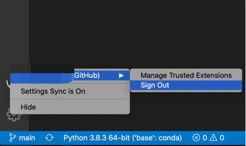

- ### Problem description:
  - Got VSC notification: 'You don't have permission to push changes to this branch...create a folk...' when pushing changes to the repo that I created in Github.
  - The way that I cloned the repo to VSC was copying the HTTP link of this repo and cloned it (perfectly normal). 
  - This is strange as the repo is public and don't need permission to make changes.
- ### One common reason that raised this issue:
  - Have two or more Github accounts, the one where the repo is created is not the same as the one signed in the VSC.
- ### How to change the Github account to:
  - Reference: [Stackoverflow1](https://stackoverflow.com/questions/42318673/changing-the-git-user-inside-visual-studio-code)
  [Stackoverflow2](https://stackoverflow.com/questions/17857283/permission-denied-error-on-github-push)
  - There are a various methods to change the account, but not all of them are useful or efficient, at least not for me :( 
  - I have tried several ways to change the account, the following steps finally solved my problem:
    - Step1: Open the VSC and click this buttom at the left bottom corne
      
      You will find that it shows the account signed in: username (GitHub), then click sign out
      
    - Step2: Sign in the new account in the similar way that you signed out. Authenticate the link between the Github account and VSC (the website page will automatically open if you have already logged in the Githut).
    - Step3: Clone and open a repo in VSC. Push or pull some changes. Now, you may have to confirm the authentication of the Github again.
    - Step4: 
      - Check your setting the credentials by:
        ```$ git config --list --show-origin```
      - Pay attention to the user.name and user.emmail, check if these two items are consistent with your Github account (username and email).
        - If not (this does not happen to me), you may need to change them by:
        ```$ git config --global user.name '<github-account-name>'```
        ```$ git config --global user.email '<github-account-email>'```
    - Step5: Try to push or pull some changes to see if the problem had been solved or not. If still not, then do the following things:
      - For windows: 
        - Go to: Control Panel -> User Accounts -> Manage your credentials -> Windows Credentials
        - Under Generic Credentials there are some credentials related to Github, Click on them and click "Remove". (from Stackoverflow, author: Luan Si Ho, [Stackoverflow](https://stackoverflow.com/questions/17857283/permission-denied-error-on-github-push))
      - For Mac: find Keychain access, delete the creditials related to Github. [Githubdoc](https://docs.github.com/cn/github/using-git/updating-credentials-from-the-macos-keychain)
      - Then unset the credentials helper by:
      ```$ git config --global --unset credential.helper```
        
        
        
    
